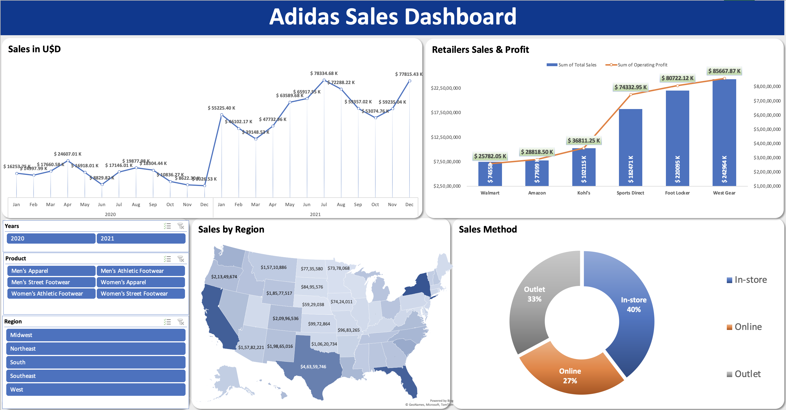

# 📊 Adidas Sales Dashboard  

This project presents an **interactive sales dashboard** built using Excel, designed to analyze Adidas sales performance across multiple dimensions such as region, retailer, product category, and sales methods.  

---

## 🚀 Project Overview  
The goal of this project is to transform raw sales data into meaningful insights through visualization.  
Key questions addressed:  
- How do sales trends change over time?  
- Which regions and retailers contribute most to revenue?  
- What is the performance by product category?  
- How do different sales channels (online, in-store, outlet) compare?  

---

## 📂 Project Files  
- **Adidas-Sales-Analysis.xlsx** → Contains raw sales data and pivot tables.  
- **Dashboard Image.png** → Snapshot of the final dashboard.  
- **README.md** → Documentation for the project.  

---

## 📈 Dashboard Features  
1. **Sales Trends (2020–2021)**  
   - Line chart showing monthly sales in USD.  
   - Highlights seasonal peaks and dips.  

2. **Retailers Sales & Profit**  
   - Bar + line combo chart of total sales and operating profit across retailers (Walmart, Amazon, Kohl’s, etc.).  

3. **Sales by Region**  
   - US map chart visualizing state-level sales distribution.  

4. **Product Categories**  
   - Filters by Men’s/Women’s apparel and footwear categories.  

5. **Sales Method**  
   - Donut chart comparing In-store, Online, and Outlet sales distribution.  

---

## 🛠️ Tools & Technologies  
- **Microsoft Excel** (Pivot Tables, Charts, Dashboarding)  
- **Data Visualization** (Line charts, Maps, Combo charts, Donut charts)  
- **Data Cleaning** and preparation  

---

## 🔍 Insights Gained  
- Sales were significantly higher in **2021 compared to 2020**, showing growth momentum.  
- **West Gear and Foot Locker** emerged as top retailers by both revenue and profit.  
- The **Southeast and West regions** recorded the strongest sales.  
- **In-store sales** remain dominant (40%), but **online sales (27%)** highlight a growing channel.  

---

## 👩‍💻 Author  

**Rania Alayachi**  
📧 alayachi.rania23@gmail.com  
🔗 [LinkedIn Profile](https://www.linkedin.com/in/rania-al-ayachi/)  

---

👉 This project is part of my **Data Analytics portfolio**, showcasing my skills in **data cleaning, visualization, and storytelling with Excel**.  
